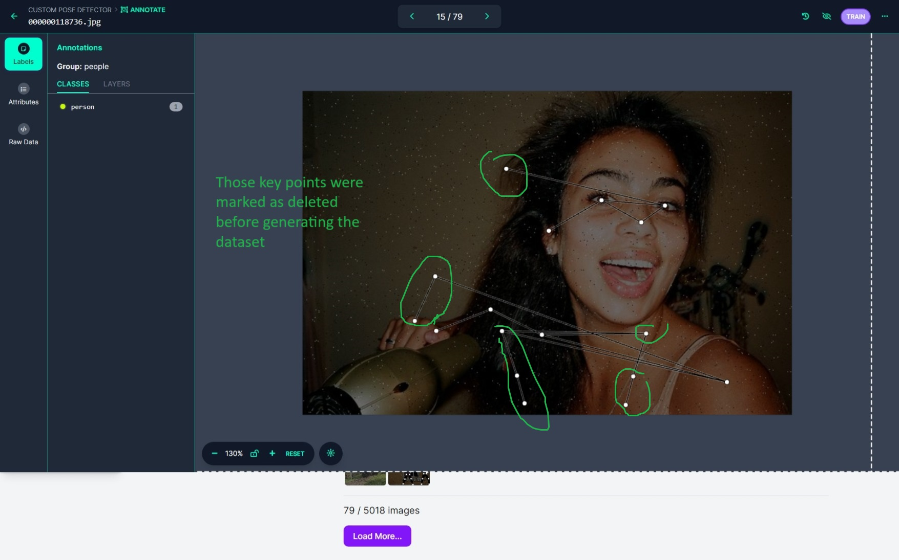

# Project Information

**FIRST NAME LAST NAME:** Viola Nguyen

**Sparring Partner:** Atvars Apinis

**Project Summary in max 10 words:** Pose detection used for a fun dancing game!

**Project Title:** Dancing Game

# Tips for Feedback Conversations

## Preparation

> Determine for yourself what you would like feedback on. Write down a few points in advance where you definitely want to receive feedback. This way, the feedback conversation will be more focused and the questions you definitely want answered will be addressed.

## During the Conversation:

> **Listen actively:** Do not immediately go on the defensive but try to listen well. Show both verbally and non-verbally that you are paying attention to the feedback by maintaining an open posture (eye contact, upright posture), taking notes, nodding...

> **Take notes:** Write down the feedback so you have it later. Note the key words and find a quick notation method for yourself. If you take good notes, you can briefly review your main feedback points at the end of the conversation.

> **Summarize:** Do not wait for a summary from the instructors, this is your task: Check if you have understood the message correctly by actively listening and summarizing in your own words.

> **Be open to the feedback:** Do not wait for a summary from the instructors, this is your task: Check if you have understood the message correctly by actively listening and summarizing in your own words.

> **Think about it:** Consider what you are going to do with the feedback and follow up. Do you find the comments justified or unjustified? Do you recognize yourself in the feedback? How are you going to address this?

## AFTER THE CONVERSATION

> Reread your notes and create action points. Make choices from all the feedback you received: What can you work on and what will you set aside for now. What were the priorities? Review the assignment sheet again to determine your focus points. Write your action points on the feedback sheet.

# Feedforward Conversations

## Conversation 1 (Date: 23/05/2024)

Lecturer: Marie Dewitte

Questions for this conversation:

- Question 1: What is the expected workflow of my project and how do I get started if I have a pretrained model?
> There are three pre-trained model I have in mind: https://www.tensorflow.org/hub/tutorials/movenet; https://chuoling.github.io/mediapipe/solutions/pose.html; https://docs.ultralytics.com/tasks/pose/. 

- Question 2: What do I do with the 'Milestone01: Data annotation' and 'Milestone02: Model is being trained' assignments if I use an already pre-trained pose estimation model?

- Question 3: I feel like my title is too simple. Should I change it to a more fun one or will it be too much?

This is the feedback on my questions.

- Feedback 1&2: If using only one pretrained model, it will overfit to "wrong" videos too. This may get taken advantage of. The added value of the whole project is under question too if taking this route. A possible solution is to combine/retrain the three models. That way the milestones will be achieved as well. 

- Feedback 3: Leave it as it is.

## Conversation 2 (Date: 29/05/2024)

Lecturer: Claudia Eeckhout

Questions for this conversation:

- Question 1: I have made some changes to my PD01 file because I am training the model on my own annotated data now. Do you approve thoe changes?

- Question 2: What else should I change about my PD01? 

- Question 3: What is the expected format of Gir Hub repository? Should I delete the mini project we did the first day from that repository?

This is the feedback on my questions.

- Feedback 1&2: The changes are fine, but there is a need to correct the version of the document too, a those are some fundamental changes. I should check if my project outcomes are up to date, too.

- Feedback 3: The mini-project we did the first day is the example of the format of the git repository that the teachers expect. I need to keep the files I need (like the bluetooth files etc), but rewrite the original code from the repository. More information about it will be announced tomorrow during the additional session about establishing connections that will be held by Pieter-Jan.

## Conversation 3 (Date: 29/05/2024)

Lecturer: Marie Dewitte

Questions for this conversation:

- Question 1: I have some issues with my model. I have annotated 730 images (from 5 videos) by manually applying bounding box and key points skeleton. However, I understand that if I train the model on those images alone it will perform poorly due to overfitting. Also, all those videos included only a certain group of people (girls) and only in full height, so the model is not able to identify the person if even one of the limbs is not in the camera sight. 
    I thought I would be able to solve this problem by combining my self-annotated data with a dataset(s) I have found on Kaggle and Roboflow Universe in Roboflow Workspace , but it was not the case. There was another two problems: the dataset I have downloaded was annotated slightly differently (left side was the right one and vice versa) and I have noticed it only after I was finished annotating the data. By playing with naming and the location of my own key points I was not able to solve the issue. 
    Another problem I have encountered was that even though the Kaggle dataset was annotated correctly and key points were displayed correctly in the workspace itself, when I tried to generate the dataset, they got messed up: deleted key points during annotation were reappearing in the generated dataset. I tried reuploading and regenerating the Kaggle dataset couple of times, but it did not help. To show you what I mean I will add a picture. 
    
    I have also tried searching for other datasets in the Roboflow Universe, but when I downloaded them I had the same issue with deleted key points reappearing. 

This is the feedback on my questions.

- Feedback 1: It's more of a background issue that I have annotated it backwards. My problem is something to fix afterwards, there are tricks to mirroring the key points. Marie wants me to train the model as soon as possible. It's not an easy project to get perfect, she won't be disappointed if it doesn't work perfectly. The model is probably overfitting on your data. This afternoon, Marie will be busy with your problem.
